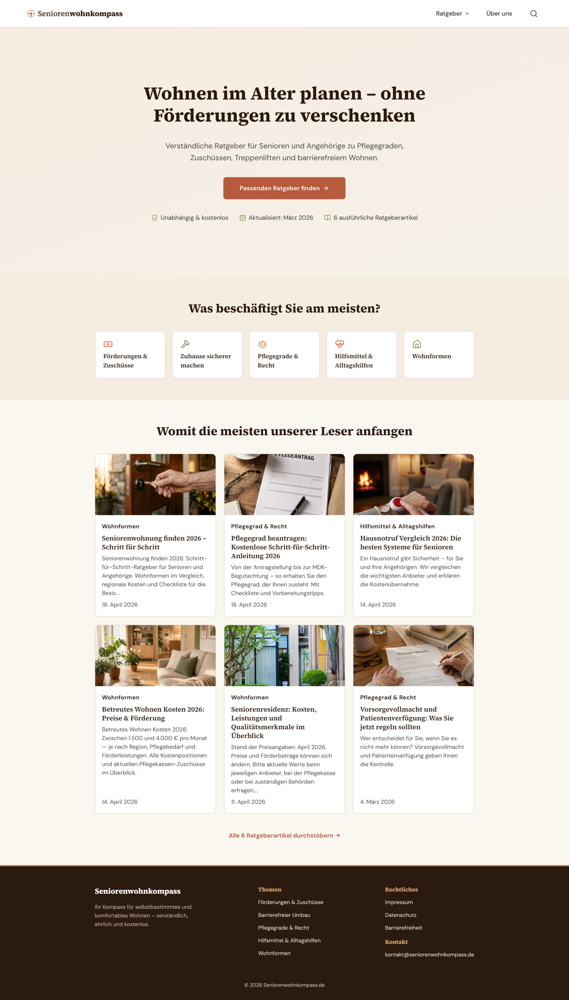

# Seniorenwohnkompass



WordPress-basierte Affiliate- und Content-Site für die DACH-Region, die Senioren (65–80) und ihre Angehörigen (40–55) durch Themen wie Pflegegrade, Wohnen im Alter, Finanzierung und rechtliche Vorsorge führt.

## Was es ist

Solo-Operator-Projekt: eine inhaltlich tiefe, recherchierte Content-Site in einem stark regulierten YMYL-Themenfeld (Your-Money-or-Your-Life). Monetarisierung über Affiliate-Empfehlungen und perspektivisch Newsletter. Ziel ist nicht hohe Frequenz, sondern Vertrauen und Genauigkeit — Beträge, Pflegegrad-Leistungen und rechtliche Hinweise müssen stimmen, weil die Zielgruppe Entscheidungen daran festmacht.

## Status

Pre-Live-Phase. Inhalte, Plugin und Site-Struktur sind produktiv aufgesetzt; der DNS-Cutover auf die Ziel-Domain steht aus. Hosting läuft auf einer EU-WordPress-Production-Box. Die Pipeline für die Content-Produktion ist aktiv und im Einsatz.

## Architektur (Übersicht)

Die Site selbst ist bewusst klassisches WordPress. Die Differenzierung liegt im **Automations- und Qualitäts-Layer drumherum**:

- **WordPress 6.x** + Kadence Child Theme + ein custom Plugin `seniorenwohnkompass-homepage` (Blocks, Templates, Custom Post Types).
- **EU-Hosting** auf einer Managed-WordPress-Plattform (Backups, Staging, deutsche Server). Strato als DNS-Registrar.
- **RankMath** für SEO, **Real Cookie Banner** für DSGVO-Consent, **Brevo** für Newsletter und transaktionale Mails.

### Content-Pipeline (separat versioniert)

Markdown-First-Workflow. Artikel werden in Markdown mit YAML-Frontmatter geschrieben und automatisiert in valides Gutenberg-Markup konvertiert und als Draft in WordPress angelegt — kein manuelles Copy-Paste in den Block-Editor:

```
Markdown-Artikel  →  Python-Pipeline  →  Gutenberg-Blocks  →  WP-REST  →  Draft
                     (Validierung,        (wp:list-item-       (Idempotent,
                      Frontmatter,         korrekt, keine       wp_post_id
                      Bildhandling)        Orphan-Comments)     in Frontmatter)
```

Verhindert die zwei häufigsten Fehlerklassen beim Markdown-zu-WP-Transfer (kaputte Listen, verwaiste HTML-Kommentare) und ermöglicht Git-versionierte Inhalte.

### Knowledge-Tracker (Quartals-Crawl)

Pflegegeld, Entlastungsbeträge und ähnliche Zahlen ändern sich gesetzlich. Ein **Quartals-Crawl** auf Pflichtquellen (BMG, GKV-Spitzenverband, VdK u. a.) erstellt Snapshots, vergleicht gegen den vorherigen Quartals-Stand und meldet Änderungen. Betroffene Artikel werden über ein `affects_articles`-Mapping in `sources.json` automatisch zur Aktualisierung markiert.

Resultat: kein Artikel mit veralteten Beträgen, ohne manuelles Tracking gesetzlicher Änderungen.

### Monitoring

Daily-Tech-Monitor läuft per Cron auf einem **Raspberry Pi im Heimnetz** (Verfügbarkeit, SSL-Status, Response-Times, Sitemap-Integrität). JSON-Reports werden zum Mac synchronisiert; Anomalien gehen über Slack-Webhook raus. Bewusste Entscheidung gegen Cloud-Monitoring-Services: minimaler Stack, volle Kontrolle, keine laufenden Kosten.

### Workflow-Orchestrierung

Alle wiederkehrenden Aufgaben sind als Slash-Commands im [Claude-Workflows-System](https://github.com/thebenfarmer/claude-workflows-portfolio) hinterlegt:

- **Content-Erstellung** — SEO-Briefing → Recherche → Draft → Multi-Agent-Review → Pipeline-Publish
- **Knowledge-Tracker-Refresh** — Quartals-Crawl + automatische Refresh-Vorschläge für betroffene Artikel
- **Recht-Re-Check** — Compliance-Audit bei Gesetzes-News oder ad-hoc

## Tech-Stack (Zusammenfassung)

| Bereich | Stack |
|---|---|
| CMS | WordPress 6.x, Kadence Child Theme, custom Plugin |
| Hosting | Managed WordPress (EU), Raspberry Pi (Monitoring) |
| Pipeline | Python (Markdown → Gutenberg, WP-REST) |
| SEO | RankMath, strukturierte Daten, internes Briefing-Framework |
| Compliance | Real Cookie Banner, DSGVO-Audits, YMYL-Quellen-Disziplin |
| Monitoring | Bash + JSON + Slack-Webhook, launchd / cron |
| Orchestrierung | Claude Code CLI mit eigenen Skills/Workflows |

## Was an dem Projekt zeigt, wie ich arbeite

- **Pipeline statt Klick-Workflow.** Inhalte werden in Git versioniert, validiert und automatisiert ausgespielt — nicht direkt im WP-Editor produziert.
- **Single Source of Truth für Zahlen.** Gesetzliche Beträge kommen aus Quartals-Snapshots, nicht aus dem Kopf.
- **Minimaler Stack, maximale Reproduzierbarkeit.** Pi-Cron + Bash + JSON statt SaaS-Monitoring — bewusste Wahl, weil die Site wenig Frequenz, aber lange Lebensdauer hat.
- **Doku ist Pflicht.** Workflows, Runbooks, Architektur-Entscheidungen sind dokumentiert (intern in Obsidian), damit das Projekt auch nach Pausen wieder anschlussfähig ist.
